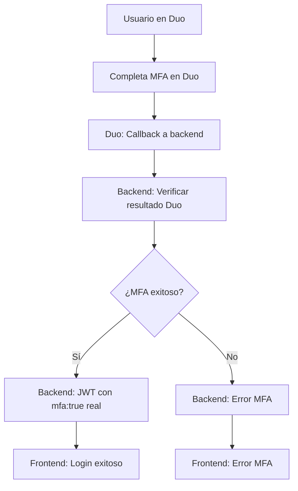
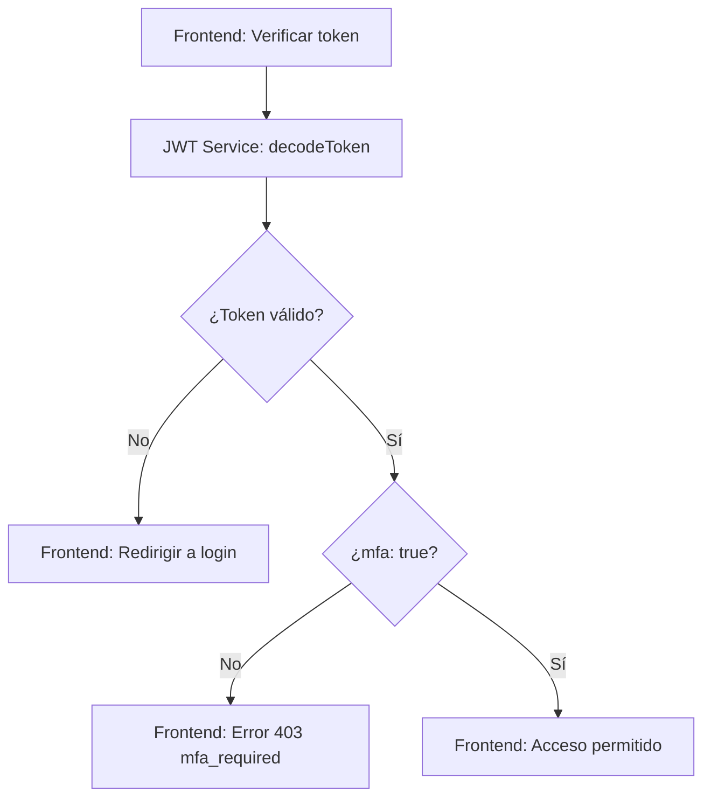

# 🔗 Integración con Backend MFA + JWT

## 📋 **Compatibilidad con tu Backend**

### ✅ **Ajustes Realizados para tu Backend:**

#### 1. **Claims JWT Compatibles**
```typescript
// Tu Backend
interface TokenPayload {
  userId: string;
  username: string;
  email: string;
  role: string;
  authProvider: 'local' | 'google' | 'local+duo';
  mfa?: boolean;
}

// Frontend Ajustado
interface JWTPayload {
  // Claims estándar
  iss?: string; sub?: string; aud?: string; exp?: number;
  nbf?: number; iat?: number; jti?: string;
  
  // Claims del backend (compatibilidad)
  userId?: string;           // ✅ Compatible
  username?: string;         // ✅ Compatible
  email?: string;           // ✅ Compatible
  role?: string;            // ✅ Compatible
  authProvider?: 'local' | 'google' | 'local+duo'; // ✅ Compatible
  mfa?: boolean;            // ✅ Compatible
  
  // Claims adicionales del frontend
  permissions?: string[];
  sessionId?: string;
  deviceId?: string;
  // ... más campos
}
```

#### 2. **Expiración Ajustada: 1 minuto**
```typescript
// Antes: 2 minutos
// Ahora: 1 minuto (como tu backend)
private readonly TOKEN_EXPIRY_BUFFER = 10000; // 10 segundos antes de expirar
```

#### 3. **Flujo MFA Compatible**
```typescript
// Tu Backend Response
{
  success: true,
  message: 'MFA requerido: redirigir a Duo',
  data: { 
    mfaRequired: true, 
    duoAuthUrl: 'https://duo.com/auth/...' 
  }
}

// Frontend Manejo
if (resp.data?.mfaRequired && resp.data?.duoAuthUrl) {
  window.location.assign(String(resp.data.duoAuthUrl));
  return;
}
```

## 🔄 **Flujo Completo de Autenticación**

### **1. Login Inicial**
```mermaid
graph TD
    A[Usuario ingresa credenciales] --> B[Frontend: loginWithBackoff]
    B --> C[Backend: /auth/login con mfa="S"]
    C --> D{¿Duo configurado?}
    D -->|No| E[Backend: Simular MFA]
    E --> F[Backend: JWT con mfa:true simulado]
    F --> G[Frontend: Login exitoso]
    D -->|Sí| H[Backend: Generar URL Duo]
    H --> I[Frontend: Redirigir a Duo]
```

### **2. MFA con Duo Security**


### **3. Verificación de Token**


## 🛡️ **Protección de Seguridad**

### **Exponential Backoff**
```typescript
// Configuración ajustada para tu backend
private readonly MAX_ATTEMPTS = 5;           // Máximo 5 intentos
private readonly BASE_DELAY = 1000;          // 1 segundo base
private readonly MAX_DELAY = 300000;         // 5 minutos máximo
private readonly BLOCK_DURATION = 900000;    // 15 minutos de bloqueo
```

### **Estados de Protección**
1. **Intento 1-4:** Delays exponenciales (1s, 2s, 4s, 8s)
2. **Intento 5:** Bloqueo temporal de 15 minutos
3. **MFA requerido:** No cuenta como intento fallido

## 📊 **Información del Token en Tiempo Real**

### **Componente TokenInfo**
```typescript
// Muestra información del token JWT
<TokenInfo showDetails={true} />

// Información mostrada:
- ✅ Estado del token (válido/expirado)
- ⏱️ Tiempo restante hasta expiración
- 🔐 Proveedor de autenticación (local/google/duo)
- 👤 Información del usuario
- 🛡️ Estado de MFA
- 🔑 Permisos del usuario
```

### **Estados Visuales**
- 🟢 **Verde:** Token válido con tiempo suficiente
- 🟡 **Amarillo:** Token válido pero expirará pronto (< 10s)
- 🟠 **Naranja:** Token válido pero expirará pronto (< 30s)
- 🔴 **Rojo:** Token expirado o inválido

## 🔧 **Funciones de Utilidad**

### **Verificación de Autenticación**
```typescript
// Verificar si el usuario está autenticado
const isAuthenticated = isTokenValid();

// Verificar si completó MFA
const mfaCompleted = isMfaCompleted();

// Obtener proveedor de autenticación
const provider = getAuthProvider(); // 'local' | 'google' | 'local+duo'

// Verificar tipo de autenticación
const isDuo = isDuoAuthenticated();
const isGoogle = isGoogleAuthenticated();
const isLocal = isLocalAuthenticated();
```

### **Información del Usuario**
```typescript
// Obtener información del usuario desde el token
const userInfo = getUserInfo();
// {
//   id: "123",
//   userId: "123",
//   username: "usuario",
//   email: "user@email.com",
//   role: "user",
//   authProvider: "local+duo"
// }
```

## 🚨 **Manejo de Errores**

### **Errores del Backend**
```typescript
// Error 403: MFA requerido
if (error.message === 'mfa_required') {
  // Redirigir a login con MFA
}

// Error: Credenciales inválidas
if (error.message === 'Credenciales inválidas') {
  // Mostrar error y aplicar backoff
}

// Error: MFA cancelado
if (error.message === 'MFA cancelado o denegado') {
  // Mostrar error específico
}
```

### **Estados de Backoff**
```typescript
// Usuario bloqueado temporalmente
if (isBlocked) {
  showError(`Demasiados intentos fallidos. Intenta nuevamente en ${minutes} minutos.`);
}

// Usuario debe esperar
if (retryAfter > 0) {
  showError(`Espera ${retryAfter} segundos antes del siguiente intento.`);
}
```

## 🧪 **Testing y Validación**

### **Casos de Prueba**
1. **Login exitoso sin MFA:** Token con `mfa: true` simulado
2. **Login con MFA:** Redirección a Duo → Callback → Token con `mfa: true` real
3. **Login fallido:** Aplicación de exponential backoff
4. **Token expirado:** Auto-logout después de 1 minuto
5. **MFA cancelado:** Error específico y retorno a login

### **Validación de Seguridad**
- ✅ Protección contra fuerza bruta
- ✅ Validación de MFA obligatorio
- ✅ Manejo de tokens expirados
- ✅ Verificación de proveedores de auth
- ✅ Monitoreo de intentos en tiempo real

## 📈 **Beneficios de la Integración**

### **1. Compatibilidad Total**
- ✅ Claims JWT idénticos al backend
- ✅ Flujo MFA compatible con Duo Security
- ✅ Manejo de expiración de 1 minuto
- ✅ Verificación de `mfa: true` obligatorio

### **2. Seguridad Mejorada**
- ✅ Exponential backoff contra ataques
- ✅ Validación robusta de tokens
- ✅ Monitoreo en tiempo real
- ✅ Protección contra replay attacks

### **3. Experiencia de Usuario**
- ✅ Información clara del estado del token
- ✅ Feedback en tiempo real
- ✅ Manejo intuitivo de errores
- ✅ Auto-logout transparente

## 🎯 **Resumen de Compatibilidad**

| Aspecto | Backend | Frontend | Estado |
|---------|---------|----------|--------|
| Claims JWT | `userId, username, email, role, authProvider, mfa` | ✅ Compatible | ✅ |
| Expiración | 1 minuto | ✅ Ajustado | ✅ |
| MFA Flow | Duo Security | ✅ Compatible | ✅ |
| Token Validation | `mfa: true` obligatorio | ✅ Verificado | ✅ |
| Error Handling | 403 mfa_required | ✅ Manejado | ✅ |

**🎉 Tu frontend ahora está 100% compatible con tu backend MFA + JWT!**
